 

 
  <!-- Primary Profile Header Asset -->
    

 

---  

### 💫 About Me
I am a second-year engineering student navigating the spaces between complex problem solving and modern interface design. 

* 🤖 **Exploring:** Generative AI implementations and Machine Learning.
* ⚡ **Core Stack:** Structured layouts built with C++, HTML/CSS, JavaScript, React, and Next.js.

  
---
# 💻 Tech Stack:
       
  

<!-- Snake Game Repo View -->

 
  

# 📊 GitHub Stats:

<!-- Side-by-Side: General Stats and Streak Stats (Matching Pink/Purple) -->

  
  

 

<!-- Contribution Graph (Stable Server, Fully Customized Aesthetic) -->

  

 

<!-- Top Languages Card (Matching Pink/Purple, Compact) -->

  

## 🌐 Socials:

  
  
  

